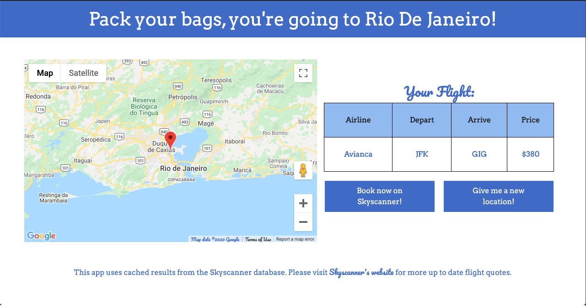

# holiday-roulette
A front-end JavaScript application that utilizes the Google Maps API and the Skyscanner API (through RapidAPI's hosting) to allow a user to generate a random city to travel to.
* Displays a map of the destination, the flight details, and a link to Skyscanner to book plane tickets. 

## Live Link

https://holiday-roulette.ninajhun.com/

## Features

* User can select an origin city
* User can generate a random destination city 
* User can view destination city on a Google Map 
* User can view flight results from Skyscanner

## Technologies Used
* JavaScript
* Google Maps API
* Skyscanner API
* jQuery AJAX 
* HTML5
* CSS3

## Getting Started 
1. Clone the repo and navigate to the directory
```shell 
 git clone https://github.com/ninajhun/holiday-roulette.git
 cd holiday-roulette
```
2. Get API keys from [Google Maps API](https://developers.google.com/maps/documentation/javascript/get-api-key) and [RapidAPI Skyscanner API](https://rapidapi.com/skyscanner/api/skyscanner-flight-search/details)

3. rename config-example.js to config.js and add your API keys 

4. Open website from `index.html` in your local code editor

## Planned Additions 

* User can start from any city 
* User can choose a departure date 

## Preview 



*Please note: this application uses RapidAPI's hosting of cached Skyscanner data. Thus, the flight quotes are not always accurate or do not return flight results even if there is an available flight. However, there is a button that will redirect you to Skyscanner to get a proper flight quote.*

